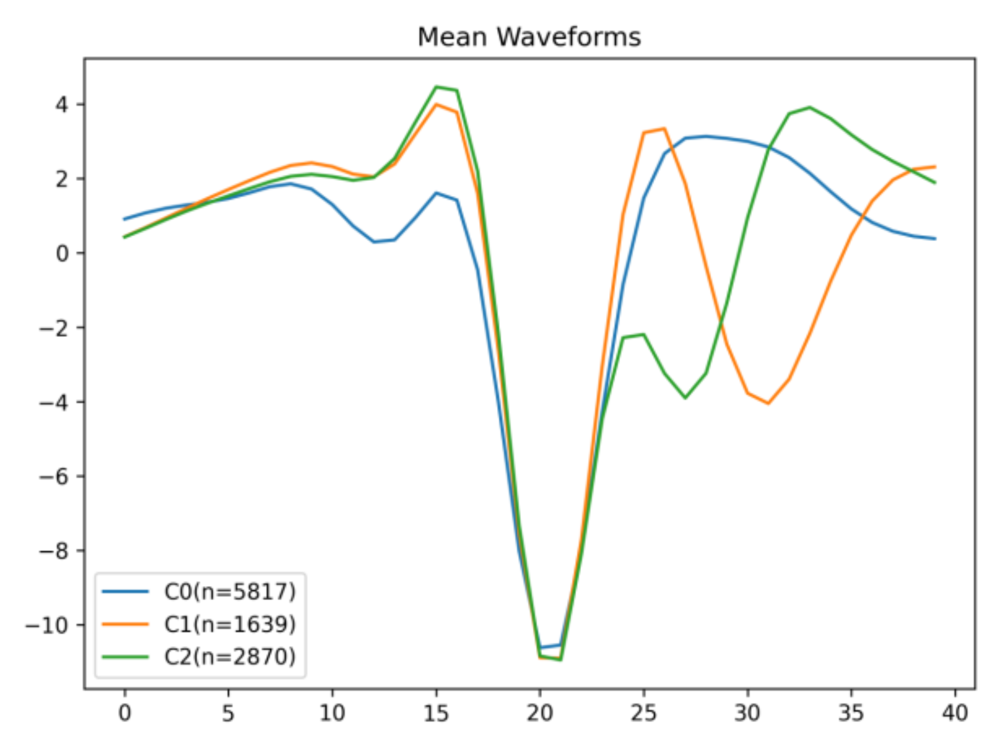
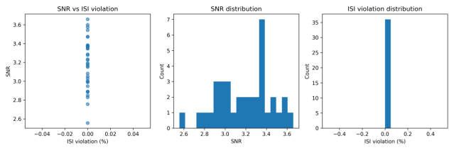

# XFastsort2




**XFastsort2** is a lightweight, reproducible spike-sorting toolkit that provides:

1) A transparent **CPU baseline pipeline** for single-channel traces (CSV):  
   bandpass → threshold detection → waveform extraction → PCA+features → KMeans clustering → QC/plots.

2) Practical **Kilosort4 integration helpers** (optional) for high-channel-count recordings:  
   run Kilosort4 (GUI or python wrapper) and export results for Phy curation.

This repository is designed for quick iteration, reproducible outputs, and GitHub-friendly organization.

---

## Pipeline overview

### A) CPU baseline sorting (single-channel CSV)
- **Input:** continuous trace in CSV with timestamp and value columns  
- **Steps:**  
  - bandpass (default 300–6000 Hz)  
  - robust threshold detection (MAD-based, default 4× SD) + refractory  
  - waveform extraction (±1 ms)  
  - embedding: PCA(waveforms) + simple waveform features (p2p/trough/peak/energy)  
  - clustering: KMeans (default k=3)  
  - QC: **SNR** and **ISI violation** per cluster  
- **Outputs:** `spikes.csv`, `cluster_quality.csv`, and plots (mean waveforms, raster, QC)

### B) Kilosort4 (GPU, optional)
For dense multichannel recordings, we recommend Kilosort4.
See **docs/KILOSORT_GUIDE.md** for a practical installation and usage summary.

---

## Installation

```bash
pip install -r requirements.txt
pip install -e .
```

CLI help:

```bash
xfastsort2 --help
```

---

## Usage

### 1) CPU sorting for a single CSV

```bash
xfastsort2 cpu-sort --csv path/to/trace.csv --outdir outputs/run1 --fs 20000 --n-clusters 3
```

Outputs under `outputs/run1/`:
- `spikes.csv` (spike index/time + cluster labels)
- `cluster_quality.csv` (n_spikes, snr, isi_violation_percent)
- `mean_waveforms.png`
- `snr_isi_qc.png`
- `raster.png`

### 2) Batch CPU sorting for a folder of CSVs

```bash
xfastsort2 batch-cpu-sort --root path/to/data --out-root outputs/batch --fs 20000 --pattern .csv
```

### 3) Run Kilosort4 (requires kilosort installed)

```bash
xfastsort2 kilosort4 --bin your.bin --probe your_probe.mat --outdir results/ --fs 20000 --n-channels 384
```

> If the Kilosort python API differs in your installed version, run via GUI: `python -m kilosort`.

---

## About Kilosort (brief intro)

Kilosort is an open-source, GPU-accelerated spike sorting pipeline developed by MouseLand.
It supports Windows and Linux and is widely used together with **Phy** for manual curation.

If you use Kilosort1–4, please cite:  
Pachitariu, M., Sridhar, S., Pennington, J., & Stringer, C. (2024). *Spike sorting with Kilosort4*. **Nature Methods**.

---

## Outputs and QC metrics

- **SNR (approx.)**: mean peak-to-peak waveform amplitude divided by (2×baseline noise std).  
- **ISI violation (%)**: percentage of inter-spike intervals below a refractory threshold (default 1.5 ms).

These metrics are intended for fast screening; for publishable sorting, use Kilosort4 + Phy curation and report your final quality criteria.

---

## Citation

If you use this code, please cite your paper / preprint here (replace the placeholder):

```bibtex
@article{your2026nefel,
  title={...},
  author={...},
  journal={...},
  year={2026}
}
```

---

## Contact

For questions and contributions, please open a GitHub issue or contact the maintainers.
