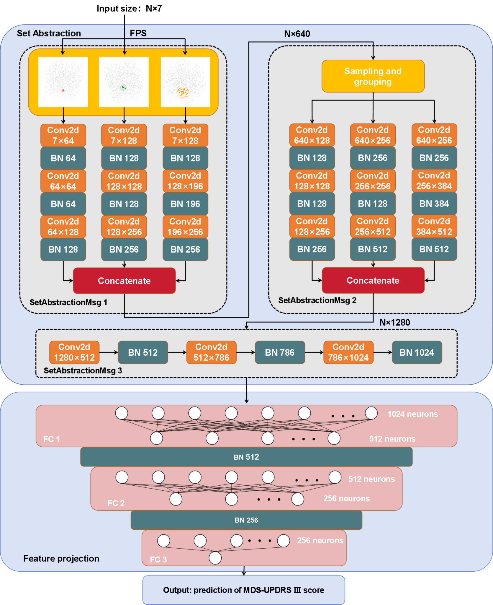
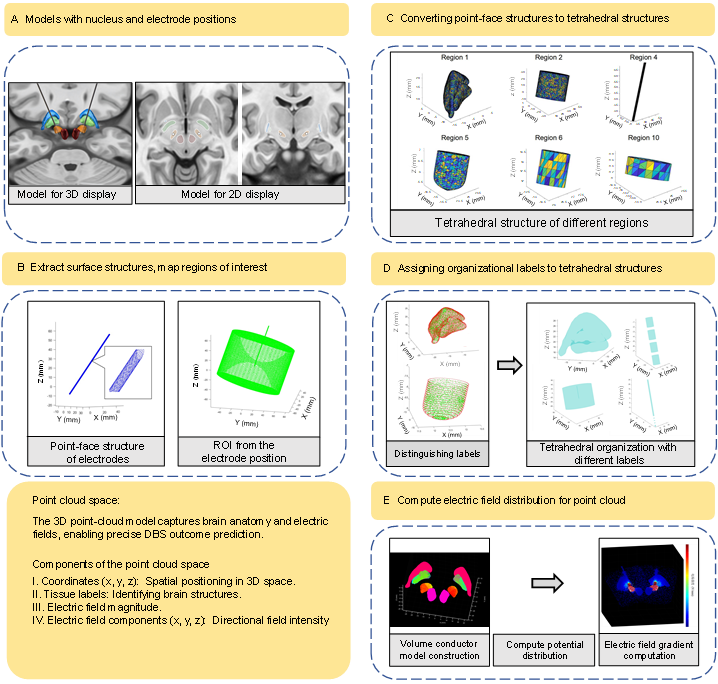

# DBS-pointnet++




PointNet++-based 3D point cloud deep learning codebase for **personalized deep brain stimulation (DBS) efficacy prediction** in Parkinson's disease (PD).

This repository provides:
- A clean, reusable **PyTorch PointNet++** implementation (set abstraction + feature projection)
- A `.npz` dataset interface for per-patient unified point clouds
- Training & evaluation utilities (regression + optional responder classification head)
- A practical point-cloud fusion utility (KD-tree kNN fusion + feature attachment), aligned with the paper’s pipeline concept

---

## What is a “unified DBS point cloud”?

Following the Methods description, the goal is to represent each patient’s DBS anatomy and stimulation field in a single point cloud:
- **Anatomy surface points** (dense points sampled from target anatomy / surrounding structures)
- **Electrode/lead geometry points** (contact-aligned surface points along the lead)
- **Electric-field (E-field) simulation nodes** (e.g., FEM outputs from COMSOL)

The paper describes KD-tree nearest-neighbor fusion (k=32) and farthest-point sampling (FPS) to enforce spatial uniformity, producing a unified point cloud representation for PointNet++.

This repo includes:
- `fuse_pointcloud_kdtree()` to attach local E-field statistics to geometry points
- `rbf_interpolate_field()` to map FEM node values onto dense query points (RBF interpolation)

> Note: imaging segmentation, electrode localization, and FEM simulation are not reproduced here; the code assumes you already have point arrays exported from your pipeline.

---

## Installation

```bash
pip install -r requirements.txt
pip install -e .
```

CLI entry point:

```bash
dbs-pointnetpp --help
```

---

## Data format

Each patient is stored as one `.npz` file with keys:

- `points`: `(N, C)` float32  
  - first 3 columns: xyz coordinates  
  - remaining columns: point-wise attributes (e.g., E-field magnitude, gradients, directional features, tissue labels, etc.)
- `y_reg`: scalar float32  
  - regression target (e.g., MDS-UPDRS III improvement/change)
- `y_cls`: scalar int64 (0/1)  
  - responder label (optional; set to -1 if unavailable)

---

## Quickstart

### 1) Train on a folder of `.npz` point clouds

```bash
dbs-pointnetpp train   --data-root data_npz/   --outdir outputs/   --num-points 20000   --epochs 50   --batch-size 4   --lr 1e-3   --lambda-reg 0.5
```

Outputs:
- `outputs/best_model.pt`
- `outputs/history.json`

### 2) Fuse geometry + E-field into a single point cloud

If you have arrays saved as `.npy`:
- anatomy xyz: `(Na,3)`
- electrode xyz: `(Ne,3)`
- efield xyz: `(Mf,3)`
- efield magnitude: `(Mf,)`

```bash
dbs-pointnetpp fuse   --anatomy-npy anatomy_xyz.npy   --electrode-npy electrode_xyz.npy   --efield-xyz-npy efield_xyz.npy   --efield-val-npy efield_E.npy   --out-npz fused_patient001.npz   --k 32
```

This generates `points` with 6 channels: `[x,y,z, E_mean, E_std, E_max]`.  
You can extend this to include gradients/directional features if your FEM export supports them.

---

## Mapping to the provided legacy script

This package refactors and cleans up the logic from `DBS_PointNetPP.py` into:
- `dbs_pointnetpp/sampling.py` — FPS + indexing + kNN grouping
- `dbs_pointnetpp/model.py` — SetAbstraction + DBSPointNetPP
- `dbs_pointnetpp/dataset.py` — `.npz` dataset with normalization & fixed-point sampling
- `dbs_pointnetpp/train.py` — training loop + evaluation metrics
- `dbs_pointnetpp/build_pointcloud.py` — KD-tree fusion + RBF interpolation
- `dbs_pointnetpp/cli.py` — CLI entry point

---

## Citation

If you find our work useful, we would appreciate it if you could cite our paper.

```bibtex
@article{Xu2026high,
  title={PointNet++-based 3D point cloud deep learning for personalized deep brain stimulation
efficacy prediction in Parkinson disease},
  author={Yinghao Zhu and Ru Wang and Minyan Ge and Yuchun Wang and Zihao Liu and Gongyi Zhu and Shugeng Chen and Bo Shen and Yimin Sun and Fengtao Liu and Jue Zhao and Narasimha M. Beeraka and Virak Sorn and Haiyin Wang and Vladimir N. Nikolenko and Jianjun Wu and Shumao Xu},
  copyright={AAAS},
  year={2026}
}
```

---

## Contact

If you have any questions, please feel free to contact 📩 **shumaoxu@fudan.edu.cn**.
