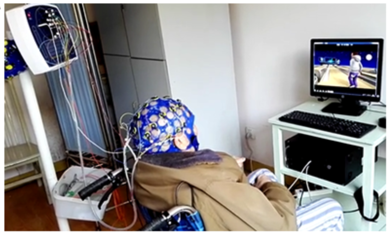
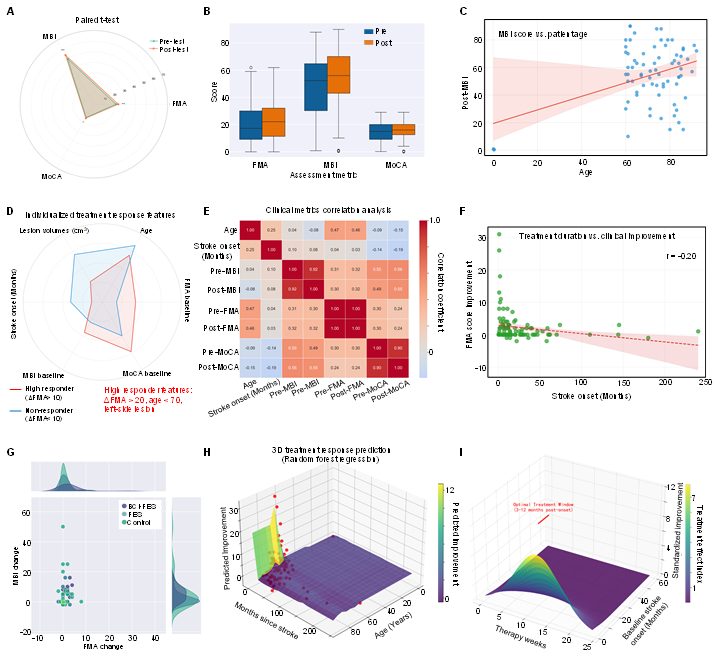

# Stroke_Random_forest_regression_prediction_timeline




Random forest regression model for **clinical time-series outcome prediction** in elderly stroke rehabilitation,
targeting **FMA improvement** (ΔFMA = post-FMA − pre-FMA).

This package implements the modeling protocol:
- **MICE-style multiple imputation** (IterativeImputer, 5 iterations)
- Normalization: **z-score** on numeric predictors (including age and stroke onset months)
- Predictors: age, stroke duration (months), pre-FMA, pre-MBI, stroke type (ischemic/hemorrhagic)
- Model: RandomForestRegressor + **5-fold CV GridSearch**
  - n_estimators: 50–200
  - max_depth: 3–10
  - min_samples_split: 2–10
- Split: 80% train / 20% validation (stratified by stroke type)
- Metrics: R², MAE, RMSE

---

## Data access

```text
Elderly stroke patients can be accessed through the Huashan Hospital's institutional repository:
PId: 893
https://himedc.huashan.org.cn:5288/redcap_v999.0.0/
```

(Please follow institutional governance/IRB and repository access procedure.)

---

## Installation

```bash
pip install -r requirements.txt
pip install -e .
```

CLI:

```bash
stroke-rf --help
```

---

## Input format

The model expects a CSV with:

| Column | Description |
|---|---|
| age | age in years |
| stroke_onset_months | months since stroke onset |
| pre_fma | baseline FMA |
| pre_mbi | baseline Modified Barthel Index |
| stroke_type | ischemic or hemorrhagic |
| post_fma | follow-up FMA (used to compute ΔFMA) |

If you already have ΔFMA, add a column named `delta_fma`; the pipeline will use it.

Example template: `examples/template_clinical_data.csv`.

---

## Quickstart

### Python API

```python
import pandas as pd
from stroke_rf_timeline.pipeline import train_validate, RFConfig

df = pd.read_csv("examples/template_clinical_data.csv")
gs, metrics, preds = train_validate(df, config=RFConfig())
print(metrics)
print(gs.best_params_)
```

### Command line

```bash
stroke-rf --csv examples/template_clinical_data.csv --outdir outputs/
```

Outputs:
- outputs/rf_gridsearch.joblib
- outputs/validation_predictions.csv
- outputs/metrics.json

---

## Citation

If you find our work useful, we would appreciate it if you could cite our paper.

```bibtex
@article{Xu2025_NEFEL_ISTBI_Fudan_University,
  title={Long-Term Brain–Computer Interface Functional Electrical Stimulation Enhances Neuroplasticity and Functional Recovery in Elderly Stroke: A 4.5-Year Longitudinal Study Integrating Electroencephalography Biomarkers and Clinical Assessments},
  author={Shugeng Chen and Na Xie and Yurui Tang and Yanyun Ji and Zhijie He and Yuchun Wang and Xude Huang and Jianghong Fu and Minyan Ge and Qiang Liu and Mingfen Li and Qinqin Xiao and Ying Xu and Jing Wang and Jie Jia and Shumao Xu},
  journal={Research},
  link={https://spj.science.org/doi/full/10.34133/research.0984}
  year={2025}
}
```

---

## Contact

If you have any questions, please feel free to contact 📩 shumaoxu@fudan.edu.cn
